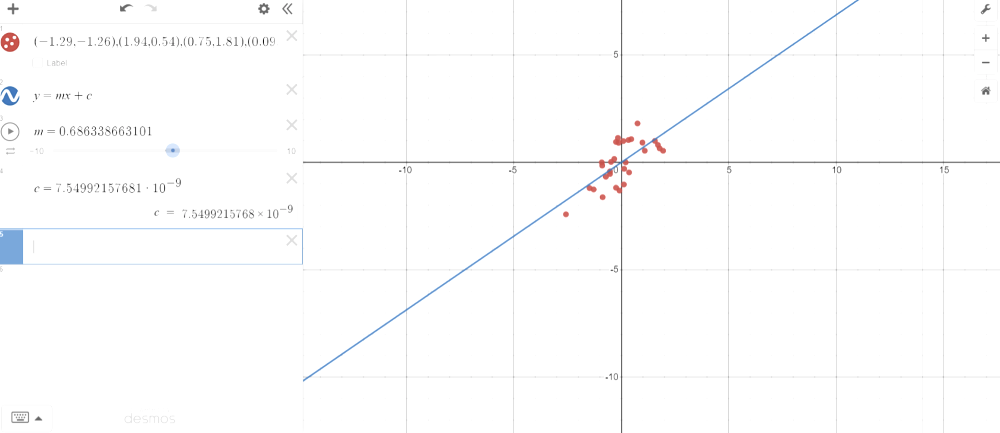
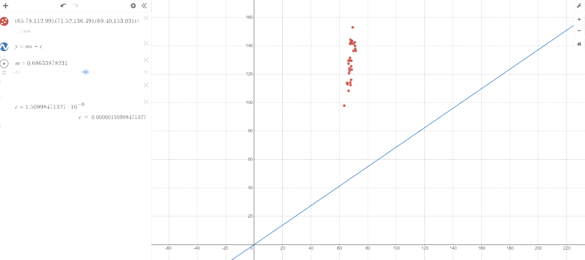
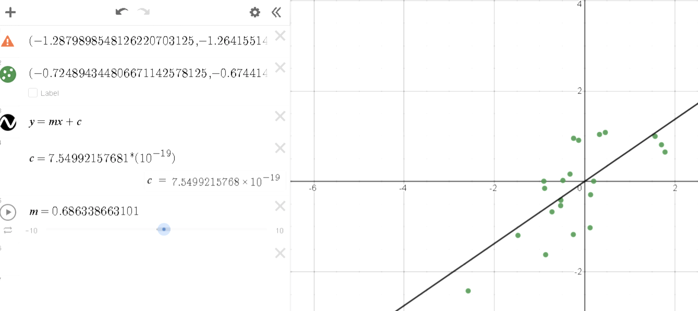
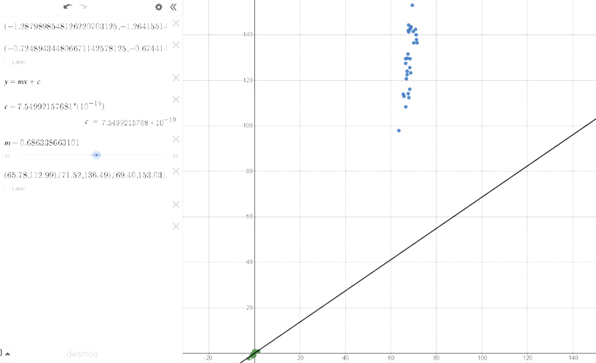
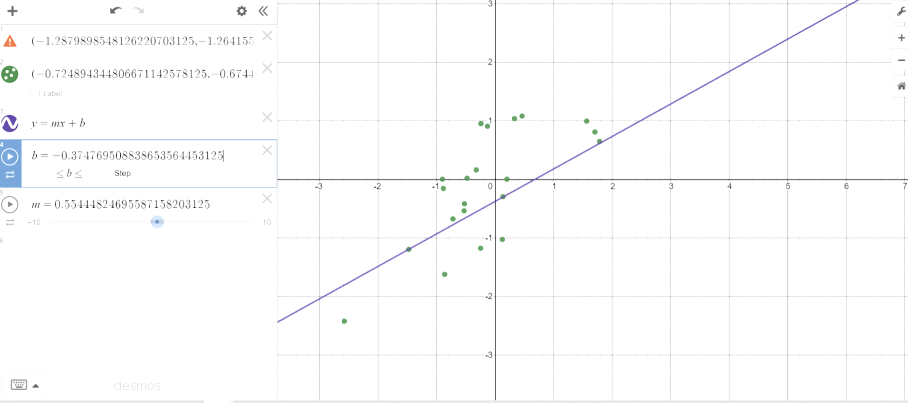

# Stochastic Gradient Descent with Assembly (LEGv8)
Linear regression model created with assembly LEGv8 architecture (June 2021)

### Pranav Maddireddy, Yusuf Morsi; June 3rd 2021

## Foreword (Feb 2023)

My friend, Pranav, and I submitted this project for our Computer Organization course (ECE30) as freshmen electrical engineering students at UC San Diego in June 2021. The assignment's goal was to write a program that implements linear regression on a 2D list of points using stochastic gradient descent (SGD) to learn a line that passes through as many points as possible.

## Loss Function

In the loss function, we explore a method of finding the accuracy of our estimation (relative to the given data); we must find the distance between every data point and the line that we created. After taking the distance between the dataset values and the estimated points, we square the differences ((yi-yi)^2), then sum them all up for the entire dataset, before multiplying that sum with (1/n) to normalize the number to find the loss. 

```assembly
////////////////////////////////////
// Write the loss function        
////////////////////////////////////
//Calculate the loss against a set of data
// Int Input: X0: arraySize, X1: array address
// Single Input: S0: m, S1: c

loss:
	// LDA X1, array
	LDA X6, inverseN
	ADD X2, X1, XZR // X2 holdes array address
	LDA X7, zeroFloat // load in 0 float value
	LDURS S7, [X7, #0] 
	ADDI X5, XZR, #0 // counter

loop2:	LDURS S3, [X2, #0] // loads x-value dataset[i][0]
	LDURS S4, [X2, #4] // loads y-value dataset[i][1]
	FMULS  S4, S4, S0   // m*xi 
	FADDS S4, S4, S1   // +c
	FSUBS  S4, S3, S4   // y-yexpected
	FMULS  S4, S4, S4   // pow(base,2) 
	ADDI X5, X5, #1
	ADDI X2, X2, #8
	FADDS  S7, S7, S4
	B check

check: SUBS XZR, X5, X0
       B.LT loop2
       LDURS S4, [X6,#0]
       FMULS  S7, S7, S4
       BR LR

```

## Training Function

In the training function, we loop through the dataset while calculating the gradient throughout it (to see how we can make the line fit the data better); subsequently, we implement the gradient into the M and C values in order to get a better line. After repeating this step, we have our line!

```assembly
////////////////////////////////////
// Write the train function //
////////////////////////////////////
// Int Input: X0: arraySize, X1: array address, X2: epoch number
// Single Input: S0: m, S1: c, S2: learning rate,  S3: -2/arraySize
// Output: S0: m, S1: c, S2: loss
train:
    //Initialize stack frame for needed variables

	//LDURS S7, [X3, #0] 
	LDURS S0, [X3, #0] // set M to 0.0
	LDURS S1, [X3, #0] // set c to 0.0
	LDA   X4, epsilon
	LDURS S4, [X4, #0] // setting epsilon to S4
	ADDI  X5, XZR, #0  // counter


loop1: 
	
	LDURS S4, [X3, #0] // set D_m = 0
	LDURS S5, [X3, #0] // set D_c = 0
	ADDI  X6, XZR, #0  // counter for loop 3 
	ADDI  X7, X1, #0   // array address counter
loop3: 
	LDURS S6, [X7, #0] // loads dataset [j][0]
	LDURS S8, [X7, #4] // loads dataset[j][1]

	ADDI  X7, X7, #8   // sets up X7 for next iteration. 
	FMULS S9, S0, S6   // M*dataset [j][0]
	FADDS S9, S9, S1   //  M*dataset [j][0]+C
	FSUBS S9, S8, S9   //  ( dataset[j][1] - (M*dataset[j][0] + C ) ) 
	FMULS S9, S9, S6   // dataset[j][0] * ( dataset[j][1] - (M*dataset[j][0] + C ) ) 
	FADDS S4, S4, S9   // D_m += dataset[j][0] * ( dataset[j][1] - (M*dataset[j][0] + C ) ) 
	FMULS S9, S0, S6   // M*dataset[j][0] 
	FADDS S9, S9, S1   // M*dataset[j][0] + c
	FSUBS S9, S8, S9   // dataset[j][1] - ( M*dataset[j][0] + C ) 
	FADDS S5, S5, S9   // D_C += dataset[j][1] - ( M*dataset[j][0] + C ) 
	ADDI  X6, X6, #1   // COUNTER +1
	SUBS  XZR, X0, X6  // checker 
	B.GT   loop3
	 
	
	FMULS S4, S3, S4   // D_m *= -2/dataset.size()
	FMULS S5, S3, S5   // D_c *= -2/dataset.size() 
	FMULS S9, S4, S2   // lr *D_m  
	FSUBS S0, S0, S9   // M - lr *D_m /
	FMULS S9, S5, S2   // lr*D_c 
	FSUBS S1, S1, S9   // C = C - lr*D_c  
	
	SUBI SP, SP, #80 // the number depends on how many instructions we wanna save (40 is temp for 5)
	STUR FP [SP, #72]
	STUR LR [SP, #64] 
	STUR X6 [SP, #8]
	STUR X7 [SP, #16]
	STURS S4 [SP, #24]
	STUR X5 [SP, #32]
	STURS S2 [SP, #40]
	STURS S3 [SP, #48] 
	STUR X2 [SP, #56] 
	ADDI FP, SP, #80
	
	BL loss 
	
	LDUR FP [SP, #72]
	LDUR LR [SP, #64]
	LDUR X6 [SP, #8]
	LDUR X7 [SP, #16]
	LDURS S4 [SP, #24]
	LDUR X5 [SP, #32]
	LDURS S2 [SP, #40]
	LDURS S3 [SP, #48] 
	LDUR X2 [SP, #56] 
	ADDI SP, SP, #80	

	//SUBIS XZR, X5, #0
	//B.EQ  past
	//LDURS S9 [SP, #0] 
	//FSUBS S9, S7, S9
	//FCMPS S9, S4
	//B.LT end
	
	SUBS XZR, X7, X10
	B.GT end

past:  
	STURS S7  [SP, #0] // store last loss value 
	ADDI  X5, X5, #1   // add to counter
	SUBS  XZR, X2, X5 	// checker
	B.GT   loop1
	
    //Call loss function at end of each epoch
    //Call loss function at the end of the function return the loss
```

## Visualization

Using the Desmos online calculator, we visualize our model. After inputting our data and equation, we can see how our line fits into our data! The attached graph (Figure 1) depicts our estimation line going through our data.

Loss Number: ~0.45 


## Early Stop of Training Using Absolute Values

Here, we implemented an if-statement that detects whether our loss gets lower than a threshold that matches our dataset (this statement is placed before the epoch iterations). If the loss is lower than the threshold, the program breaks. We were able to implement this with two lines of code.

```assembly
FCMPS S14, S7
B.GT end
```

## Early Stop of Training Using Difference in Losses

Similar to the previous section, this function calculates the difference between the current loss and the last iteration's loss, to see if it is less than the given epsilon value. If it is, the training function is halted.

```assembly
SUBIS XZR, X5, #0
	B.EQ  past
	LDURS S9 [SP, #0] 
	FSUBS S9, S7, S9
	FCMPS S9, S4
	B.LT end

past:  
	STURS S7  [SP, #0] // store last loss value 
	ADDI  X5, X5, #1   // add to counter
	SUBS  XZR, X2, X5 	// checker
	B.GT   loop1

```

## Normalization of Dataset

After running the linear regression algorithm on “RawSOCRdata.txt” and we realize that the results look strange and are not matched with our line (the slope was off); we believe that this went wrong because we didn’t normalize the points prior to running the algorithm, so our graph below shows what it looks like when we have a normalized estimation without a normalized dataset. This equation ensures that our data is consistent and in the same format, and is essential for us to be able to accurately analyze and interpret data.



Here, we use data standardization by taking our data point, subtracting the average, and dividing that difference by the standard deviation (σ). Doing this to normalize the data solved the issue that is depicted in the above image (Figure 2). The following is the graph after we fixed the data (Figure 3):



The following (Figure 4) is a graph with both datasets (normalized in green and unnormalized in blue): 



```assembly
M: NAN (7FC00000)
C: NAN (7FC00000)
Loss: NAN (7FC00000)
Normal: 

	LDURS S6, [X15, #0] // loads dataset [j][0]
	LDURS S8, [X15, #4] // loads dataset[j][1]
	
	FSUBS S6, S6, S10 
	FDIVS S6, S6, S12
	FSUBS S8, S8, S11
	FDIVS S8, S8, S13
	STURS S6, [X15, #0]
	STURS S8, [X15, #4] 	
	ADDI  X15, X15, #8   // sets up X15 for the next iteration. 
	ADDI  X16, X16, #1
	SUBS  XZR, X0, X16  // checker 
	B.GT   Normal
	Br LR

```

### Normalization Conversions:

```text
(-1.2879898548126220703125 , -1.2641551494598388671875) , (1.94417703151702880859375 , 0.540391564369), 
( 0.75041735172271728515625, 1.810484409332275390625), (0.08596451580524444580078125, 0.98960769176483154296875 ), 
( -0.15616671741008758544921875, 1.14012658596038818359375) , (0.3562479317188262939453125,  -0.4724581539630889892578125), (0.97565639019012451171875, 0.924337565898895263671875), 
( 1.093905925750732421875, 0.53808796405792236328125 ),
 ( -0.09422586858272552490234375, -1.31176412105560302734375 ), 
( -0.724894344806671142578125, -0.674414098262786865234375 ), (-0.888192594051361083984375, -0.15378344058990478515625), 
( -0.251891911029815673828125, -1.175847530364990234375), (0.1310131847858428955078125, -0.29507529735565185546875 ),
 ( -0.53343963623046875, -0.536961376667022705078125 ), (0.119748868048191070556640625, -1.02610874176025390625),
 ( 1.70204579830169677734375, 0.809921205043792724609375 ), (-0.90508472919464111328125, 0.00363464490510523319244384765625 ), (0.328095734119415283203125, 1.03798520565032958984375 ), (1.7808830738067626953125, 0.648663461208343505859375 ), (-0.527811825275421142578125, -0.4156343042850494384765625),
 ( -0.133642375469207763671875, 0.908211290836334228515625), (0.457605302333831787109375, 1.0817544460296630859375), (-2.5831091403961181640625, -2.4229037761688232421875 ),
 ( 0.19858188927173614501953125, 0.00363464490510523319244384765625 ),
 ( -0.24626405537128448486328125, 0.951981723308563232421875), (-0.4827631413936614990234375, 0.02052836306393146514892578125), (1.5612719058990478515625, 0.995750963687896728515625), 
(-0.32509708404541015625, 0.1610527336597442626953125), (-0.865668237209320068359375, -1.621992588043212890625), 
( -1.479440212249755859375, -1.1950447559356689453125)

```



```text
Normalized Results: 
m: 0.55444824695587158203125
c:-0.374769508838653564453125
Loss: 48.793376922607421875
```

## Conclusion

We were able to successfully normalize the data but ended up getting a high loss value. When we attempted to fix the issue we had problems with running Legiss (kept stalling out). This could be due to an infinite loop somewhere but the only thing we added was the normalization part and I couldn’t find anything through debugging. 


## Afterword (Feb 2023)

At the time of this project, I was frustrated with assembly and absoluted loathed learning about it. However, after completing this it, I found myself able to appreciate assembly, and LEGv8 in particular. It opened my eyes to a very fundamental part of ECE, and paved the path for my future.


